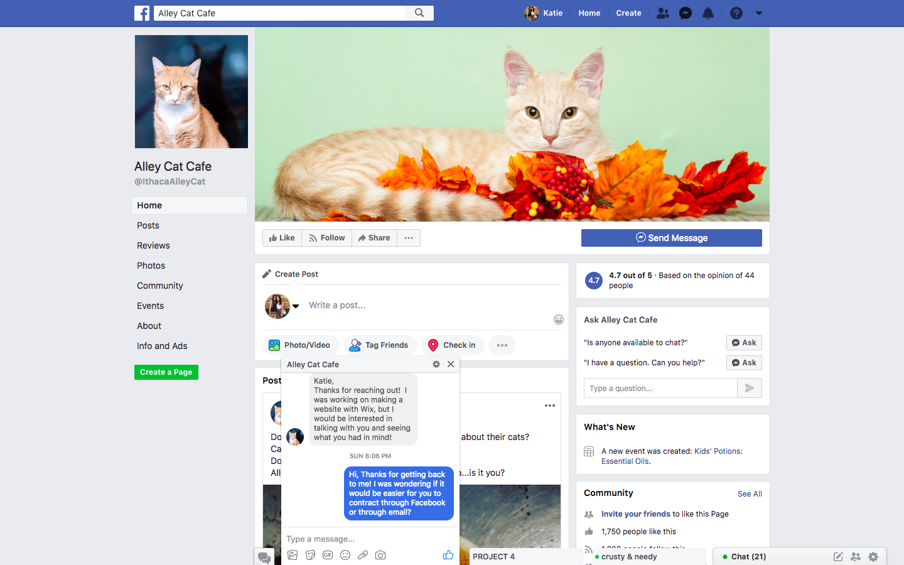
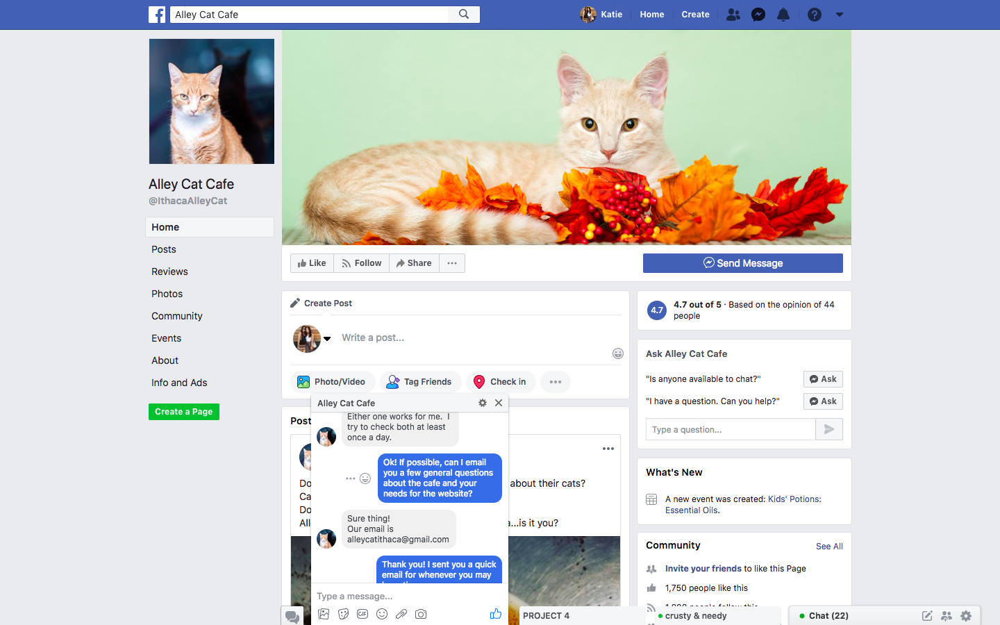
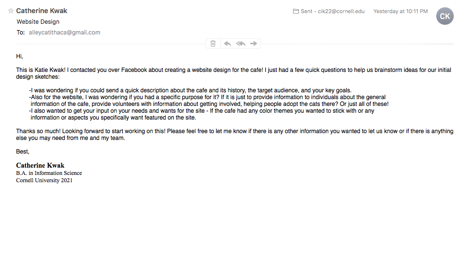
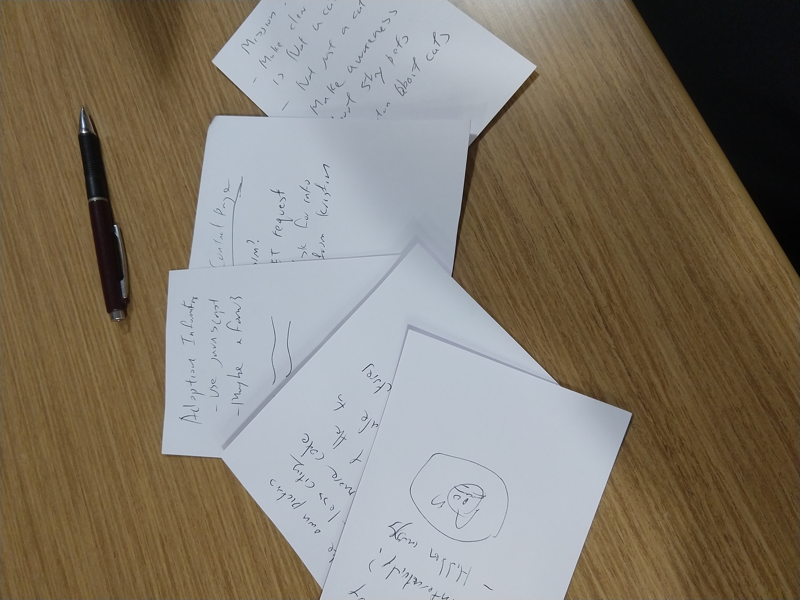
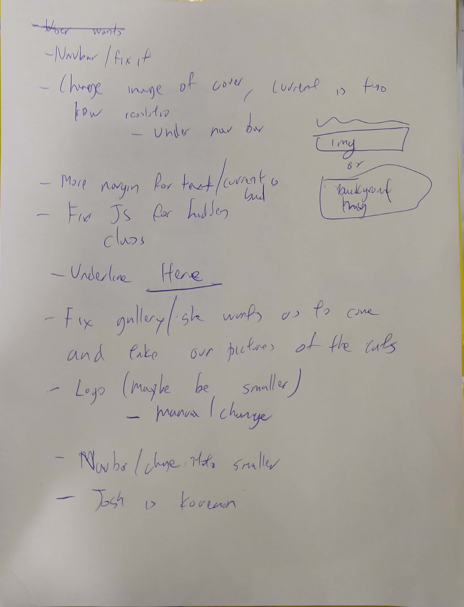
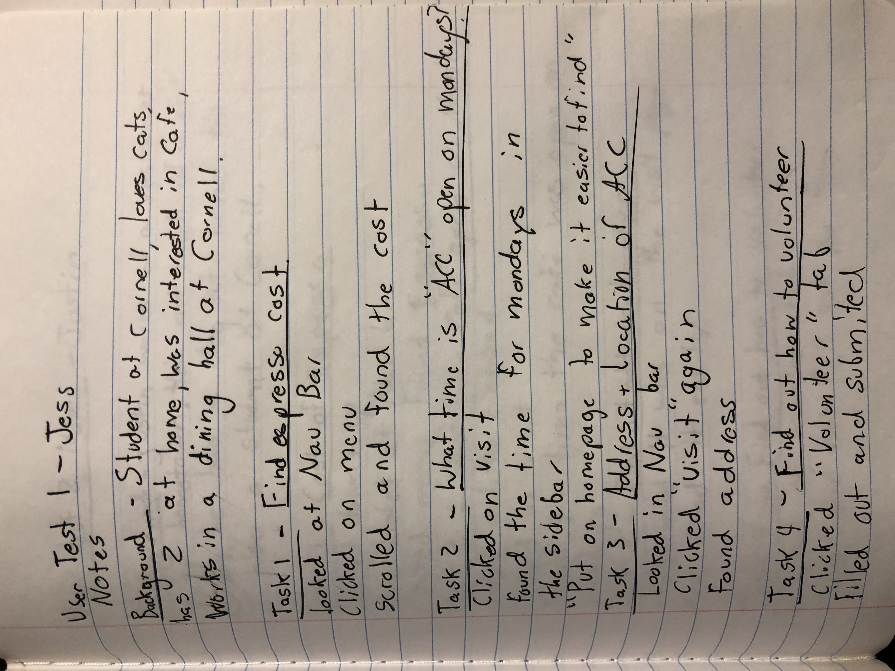
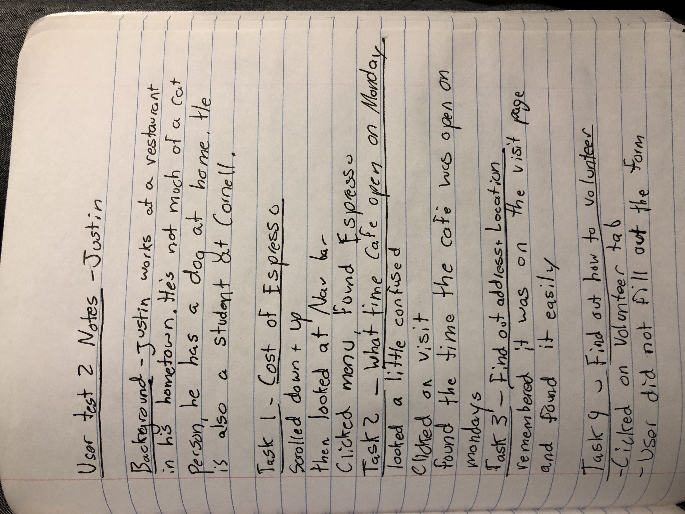
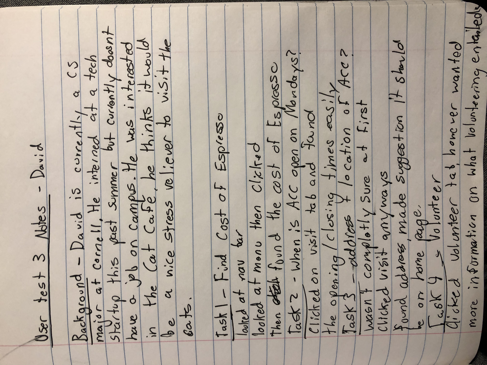

Café# Project 4 - Design & Plan

Your Team Name: Brown Scorpion

## Milestone 1: Design your Client's Site

### Client Selection (Milestone 1)

#### Client Description

[Tell us about your client. Who is your client? What kind of website do they want? What are their key goals?]

Our client is the Alley Cat Café located in Downtown Ithaca at 312 East Seneca Street. Kristin, the owner of Alley Cat Café, wants a website that serves both descriptive purposes and marketing purposes. Descriptive purposes to show potential customers what services the Alley Cat Café can offer. Marketing purposes to bring customers in and improve their revenue.

Key goals
- One of their key goals is to get cats to be adopted by the Ithaca community. To raise awareness of stray pets, especially cats in particular.
- Bring in potential customers and pet owners into their cat café
- Improve revenue of the café business

[NOTE: If you are redesigning an existing website, give us the current URL and some screenshots of the current site. Tell us how you plan to update the site in a significant way that meets the Project 4 requirements.]

- We are not re-designing a website. Kristin was in the process of designing a website using the service, Wix, however when we contacted her. She was enthusiastic of working with us to expediate the process of designing her website.

### Client Needs & Wants/Requirements (Milestone 1)

#### Purpose & Content

[Tell us the purpose of the website and what it is all about.]
- The purpose of the website is to raise awareness about adoptable cats and build a safe community where homeowners can connect with the cat community.
- To generate interest in cat café services and food products
- Provide content about cats through Mission page, adoption information page.
- Provide information about a safe space for stray cats
#### Client Needs and Wants

[Collect your client's needs and wants for the website. Come up with several appropriate design ideas on how those needs may be met. In the **Memo** field, justify your ideas and add any additional comments you have. There is no specific number of needs required for this, but you need enough to do the job.]

Example:
- Needs/Wants #1
  - **Needs and Wants** [What does your client and audience need and want?]
    - Kristin (client) wants to provide general descriptive information about the Alley Cat Café services
  - **Design Ideas and Choices** [How will you meet those needs and wants?]
    - Create web-pages and paragraph sections in html content pages
      - specifically a visit page and mission page
        these pages will provide the audience with info on what the cafe does and info on how much the cafe costs
  - **Memo** [Justify your decisions; additional notes.]
    - We should provide multiple pages presenting users with information about the cat cafe's mission and general information. Since the cafe's mission statement is so strong, it might be good to split these into different pages.

- Needs/Wants #2
  - **Needs and Wants** [What does your client and audience need and want?]
    - Kristin (client) wants to provide volunteers with information about how to get involved with the cat community in Ithaca
  - **Design Ideas and Choices** [How will you meet those needs and wants?]
    - Create a webpage, such as volunteer.html, to provide information and requirements for how to get involved. Or for how to become a volunteer at the cat cafe. Maybe a form to get interested applicant's information?
  - **Memo** [Justify your decisions; additional notes.]
    - The form will provide Kristin with interested applicants who have a passion for volunteering for animals. A webpage will just show information.

- Needs/Wants #3
  - **Needs and Wants** [What does your client and audience need and want?]
    - Kristin (client) wants to provide users with pictures so they can have a better idea of what they are getting themselves into.
  - **Design Ideas and Choices** [How will you meet those needs and wants?]
    - We could make a page devoted to just the images
    - in order to provide a lot of images without causing clutter, we could create a slideshow with javascript interactivity so the user can scroll through
  - **Memo** [Justify your decisions; additional notes.]
    - The users will want to see what the cafe is like, especially if they have never been to such a place before.

#### Client Meeting Notes

[By this point, you have met once with your client to discuss all their requirements. Include your notes from the meeting, an email they sent you, or whatever you used to keep track of what was discussed at the meeting. Include these artifacts here.]

Facebook Contact One


Facebook Contact Two



### Target Audience (Milestone 1)

#### Target Audience(s)

[Tell us about the specific audience(s) for this website.]
The specific audience for the Alley Cat Cafe are people who are interested in visiting the cafe. These individuals interested in visiting may also be interested in volunteering or adopting the cats.

#### Target Audience Needs

[What are the needs of your target audience(s)? Note that these are probably *not* the needs of your client.]
- The target audience needs to be able to...
  - see where the cat cafe is and it's hours.
  - see the menu and it's costs
  - see pricing for going to Cafe
  - contact the owner with any questions
  - register to volunteer if interested
### Initial Design (Milestone 1)

#### Content

[Place your content in the **content** folder. NOT in the documents folder.]

[Note any content (e.g., text, image) that you need to make/get from the client here.]
- Content not made available to us by Kristin yet.
#### Content Organization, Information Architecture, and Navigation

[Lay out the plan for how you'll organize the site and which content will go where. Plan out the navigation for the site. Document your process for organizing the content.]

[Note: As with the Needs and Wants table, there is no specific amount to write here. You simply need enough content to do the job.]

Example:
- **Content** (List all the content corresponding to main navigation and sub-categories.)
  - *Portfolio*: list all the projects (as images) this client has worked on. When the image is hovered over, display a description of the project; add a search function to enable users search for specific projects;

  - *Websites*: showcase all the websites designed by the client, with thumbnail images and a brief description for each design;

  - *Mobile Apps*: showcase all the mobile apps designed by the client, with thumbnail images and a brief description for each design;

  - *Tablets*: showcase all the tablet applications designed by the client, with thumbnail images and a brief description for each design;

  - **Navigation**
    - *Home*
     - general info about the cafe. Intro to cafe and reviews about what people think about the cafe.
    - *Mission*
     - stating the mission of the Alley Cat Cafe and where the cats come from
     - *Visit*
      - provides information about address, hours, and cost
    - *Gallery*
     - gallery of the available cats for viewers to see.
    - *Menu*
     - lists the available foods from the menu provided by the Alley Cat Cafe and their prices.
    - *Volunteer*
     - provides info about how to volunteer at the Alley Cat Cafe. Also has a form to register for volunteer opportunities.
    - *Contact*
     - provides email and phone number for Kristin. Also contains Facebook and Twitter information.


- **Process**
  - [photo of card sort]
  
  - [explanation of how your come up with your content organization and navigation.]
    We just decided to come up with a typical design according to suggested needs and wants by Kristin. As we are still in the developmental stage, we are still modifying designs and layouts around. Right now, we have Home, Mission, Cats, Menu, Volunteer, Adopt, Contact. Just the basic informational pages as of right now.
#### Sketches

[Include exploratory idea sketches of your website.]
mobile


Mobile 3 includes image of the open navigation bar in the mobile design
[Include sketches of your finalized design.]


#### Interactivity

[What interactive features will your site have? Describe how the interactivity connects with the needs of the clients/target audience.]

- Form for sending information to Kristin about potential interested customers
- Two forms may be used, another one for adoption information.
- Hiding of webpages about adoption information in a website dominated by cat cafe content, this will done using javascript.

#### Additional Comments (Milestone 1)

[If you feel like you haven't fully explained your design choices, or if you want to explain some other functions in your site (such as special design decisions that might not meet the Project 4 requirements), you can use this space to justify your design choices or ask other questions about the project and process.]
- No additional comments as of right now.

## Milestone 2: Draft of Coded Website

### Interactivity (Milestone 2)

[Write your interactivity pseudocode here. Remember you must use two conditional statements.]

Example:
```
if today is a monday:
  show Monday's soup and the daily special

```
1. Automatic Slideshow
Start on first picture
If on Index.html page,
  Wait 3 seconds
  Move onto next picture
  repeat

2. Manual slideshow
Start on the first picture
If user presses the next button
  Move to next chronological picture in the Slideshow
If the user presses the previous button
  Move to the previous chronological picture in the Slideshow

3. Volunteer volunteerValidation
When the user tries to submit the form:
  If the name is empty or is not a text:
    Show a feedback message to "Please enter your name"
    Do not submit the form.
  If the email is empty or is not of type email:
    Show a feedback message "Please enter an valid email".
    Do not submit the form.
  If the age is empty or is not of type number:
    Show a feedback message "Please enter your age".
    Do not submit the form.
  Otherwise,
    Show no feedback message
    Submit the form.

### Tasks (Milestone 2)

[You will need to come up with at least 4 tasks. List your tasks here. You *do not* have to do user tests yet.]

Task 1: Find out how much an espresso costs

Task 2: Find out when The Alley Cat Cafe is open on Mondays.

Task 3: Find out the address and location of the Alley Cat Cafe

Task 4: Find out how to volunteer and get involved in the local Ithaca Cat Community.

### Client Meeting (Milestone 2)

[By this point, you have met once with your client a second time to discuss your initial design. Include your notes from the meeting, an email they sent you, or whatever you used to keep track of what was discussed at the meeting. Write a few sentences about the design feedback you received from your client.]

Notes from the meeting

### Additional Comments (Milestone 2)

[If you feel like you haven't fully explained your design choices, or if you want to explain some other functions in your site (such as special design decisions that might not meet the Project 4 requirements), you can use this space to justify your design choices or ask other questions about the project and process.]


## Milestone 3: Presentation & Demo Ready Draft

### Additional Comments (Milestone 3)

[If you feel like you haven't fully explained your design choices, or if you want to explain some other functions in your site (such as special design decisions that might not meet the Project 4 requirements), you can use this space to justify your design choices or ask other questions about the project and process.]


## Final Submission: Complete, Polished, and User Tested Website

### Changes Based on Presentation (Final Submission)

- We increased the font size for many of the webpages
- we also made the images in the gallery uniform in size

### User Testing (Final Submission)

#### Participant 1

1. Who is your participant, e.g., what is their name, where do they comes from, what is their job, characteristics, etc.?
The first participant is a student named Jess. She currently goes to Cornell university and works in a dining hall. She was very interested about the cafe when we told her about it and said she would like to visit one day. She likes cats a lot and actually has two at home.

2. Does your participant belong to your target audience of the site? (Yes / No)
Yes she does belong to the target audience.

[If “No”, what’s your strategy of associating the user test results to your target audience’s needs and wants? How can your re-design choices based on the user tests make a better fit for the target audience?]

[Report the results for your user's performance on each of your tasks. You should **describe the task** you ask the user to complete, explain **what the user did**, describe the user's **reaction/feedback** to the design, **reflect on the user's performance**, determine what **re-design choices** you will make. You can also add any additional comments in the **memo** field.]

Format:
- Task #1
  - **Task Description** (What was the task for this user?)
    - Find out how much an espresso costs.
  - **How did the user do? Did that meet your expectation?**
    - When she was on the homepage of the website she looked at the navigation bar
    - Next she clicked on the menu button
    - She then scrolled down to find the price of an espresso which is 2.75
  - **User’s reaction / feedback to the design** (e.g., specific problems or issues found in the tasks)
    - She had no problem finding this, and actually said that it was really easy. She said she liked the design of the navigation bar
  - **Your reflections about the user’s performance to the task**
    - The user performed the task as expected.
  - **Re-design choices**
    - We have no redesign choices. This task was easy for the participant to complete.
- Task #2
  - **Task Description** (What was the task for this user?)
    - The second task was to find out what time the alley cat cafe is open on Mondays.
  - **How did the user do? Did that meet your expectation?**
    - When she was on the homepage of the website she looked at the navigation bar
    - Next she clicked on the visit button
    - She then looked at the sidebar and saw the times for the alley cat Cafe
    - **User’s reaction / feedback to the design** (e.g., specific problems or issues found in the tasks)
      - She had no problem finding this. She said maybe to make it even easier we could put the times on the homepage.
    - **Your reflections about the user’s performance to the task**
      - The user performed the task as expected.
    - **Re-design choices**
      - We have no redesign choices. This task was easy for the participant to complete. However we may want to include the hours on the homepage as well.
- Task #3
  - **Task Description** (What was the task for this user?)
    -  Find out the address and location of the alley cat Cafe
  - **How did the user do? Did that meet your expectation?**
    - Looked at navigation bar on the homepage
    - Pressed on the visit tab again
    - The address came up right in front of her as soon as she entered the page.
  - **User’s reaction / feedback to the design** (e.g., specific problems or issues found in the tasks)
    - Once again she thought it was easy to find the address by just clicking on the visit tab.
  - **Your reflections about the user’s performance to the task**
    - The user performed the task as expected.
  - **Re-design choices**
    - Once again We have no redesign choices. This task was easy for the participant to complete.
- Task #4
  - **Task Description** (What was the task for this user?)
    -  Find out how to volunteer and get involved in the Ithaca cat community.
  - **How did the user do? Did that meet your expectation?**
    - Looked at navigation bar on the homepage
    - She pressed on the volunteer tab
    - Then filled out her information and clicked submit
  - **User’s reaction / feedback to the design** (e.g., specific problems or issues found in the tasks)
    - She found this easy and she liked how we had a tab for volunteering, as she likes cats.
  - **Your reflections about the user’s performance to the task**
    - The user performed the task as expected.
  - **Re-design choices**
    - Once again we have no redesign choices. This task was easy for the participant to complete.
[Include evidence of your user testing process.]
Notes taken with participant 1:


#### Participant 2

1. Who is your participant, e.g., what is their name, where do they comes from, what is their job, characteristics, etc.?
The second participant is Justin. He is currently a hotel major at /Cornell University. He works at a restaurant when he goes back to his hometown. Justin doesn't really like cats. His family has always had a dog. Nevertheless he did find the cafe interesting and thought maybe he would visit sometime.

2. Does your participant belong to your target audience of the site? (Yes / No)
Yes

[If “No”, what’s your strategy of associating the user test results to your target audience’s needs and wants? How can your re-design choices based on the user tests make a better fit for the target audience?]

[Fill this out like you did for Participant 1 above]
- Task #1
  - **Task Description** (What was the task for this user?)
    - Find out how much an espresso costs.
  - **How did the user do? Did that meet your expectation?**
    - He was on the homepage and scrolled down, then back up.
    - He then looked at the navigation bar.
    - He then clicked on the menu button.
    - He then scrolled down and found the cost of the espresso.
  - **User’s reaction / feedback to the design** (e.g., specific problems or issues found in the tasks)
    - He thought it was pretty easy to find it. He knows the website of the restaurant he works at has the prices of items on the menu page so he thought it was pretty simple to just look there on our website.
  - **Your reflections about the user’s performance to the task**
    - The user performed the task as expected.
  - **Re-design choices**
    - We have no redesign choices. This task was easy for the participant to complete.
- Task #2
  - **Task Description** (What was the task for this user?)
    - The second task was to find out what time the alley cat cafe is open on Mondays.
  - **How did the user do? Did that meet your expectation?**
    - Once again he looked at the navigation bar.
    - He looked a little confused on what he should do next, but he clicked on the visit tab.
    - He then found the times that the alley cat cafe was open on mondays.
    - **User’s reaction / feedback to the design** (e.g., specific problems or issues found in the tasks)
      - He had no problem with this task, he thought it was pretty easy.
    - **Your reflections about the user’s performance to the task**
      - The user performed the task as expected.
    - **Re-design choices**
      - We have no redesign choices. This task was easy for the participant to complete. However we may want to include the hours on the homepage as well, after hearing from participant 1.  
- Task #3
  - **Task Description** (What was the task for this user?)
    -  Find out the address and location of the alley cat Cafe
  - **How did the user do? Did that meet your expectation?**
    - He clicked on the visit page again, he said he remembered seeing the address on this page.
    - Met our expectations
  - **User’s reaction / feedback to the design** (e.g., specific problems or issues found in the tasks)
    - He found the address and he thought it was easy.
  - **Your reflections about the user’s performance to the task**
    - The user performed the task as expected.
  - **Re-design choices**
    - Once again We have no redesign choices. This task was easy for the participant to complete.
- Task #4
  - **Task Description** (What was the task for this user?)
    -  Find out how to volunteer and get involved in the Ithaca cat community.
  - **How did the user do? Did that meet your expectation?**
    - He looked at the navigation bar and clicked on the label for volunteer.
    - He didn't fill it out because he was not interested.
  - **User’s reaction / feedback to the design** (e.g., specific problems or issues found in the tasks)
    - He thought it was interesting that we had a volunteer form, and thought it was cool for people who would want to volunteer in the cat community.
  - **Your reflections about the user’s performance to the task**
    - The user performed the task as expected.
  - **Re-design choices**
    - Once again we have no redesign choices. This task was easy for the participant to complete.
Notes taken with participant 2:


#### Participant 3

1. Who is your participant, e.g., what is their name, where do they comes from, what is their job, characteristics, etc.?
David is currently a CS major at Cornell. He interned at a startup tech company this past summer but currently does not have a job on campus. He was interested in the cat cafe because he thinks it would be a nice stress reliever to visit the cats.

2. Does your participant belong to your target audience of the site? (Yes / No)
Yes
[If “No”, what’s your strategy of associating the user test results to your target audience’s needs and wants? How can your re-design choices based on the user tests make a better fit for the target audience?]

- Task #1
  - **Task Description** (What was the task for this user?)
    - Find out how much an espresso costs.
  - **How did the user do? Did that meet your expectation?**
    - He looked at the nav bar, says he normally looks at the nav bar to find certain categories.
    - Looked at menu, said he thought that the espresso price would be There
    - He then clicked on menu then found the price of the espresso
  - **User’s reaction / feedback to the design** (e.g., specific problems or issues found in the tasks)
    - The user thought that it was easy to find the cost of an espresso. Usually when he goes to other sites for restaurants he finds prices under menu.
  - **Your reflections about the user’s performance to the task**
    - The user performed the task as expected.
  - **Re-design choices**
    - We have no redesign choices. This task was easy for the participant to complete.

- Task #2
  - **Task Description** (What was the task for this user?)
    - The second task was to find out what time the alley cat cafe is open on Mondays.
  - **How did the user do? Did that meet your expectation?**
    - He clicked on the visit tab and found the opening time for alley cat cafe easily.
    - **User’s reaction / feedback to the design** (e.g., specific problems or issues found in the tasks)
      - Once again this user thought it was very easy to find the opening time.
    - **Your reflections about the user’s performance to the task**
      - The user performed the task as expected.
    - **Re-design choices**
      - We have no redesign choices. This task was easy for the participant to complete. However we may want to include the hours on the homepage as well, after hearing from participant 1.  
- Task #3
  - **Task Description** (What was the task for this user?)
    -  Find out the address and location of the alley cat Cafe
  - **How did the user do? Did that meet your expectation?**
   - He admitted he wasn't exactly sure where to go but then just ended up clicking the visit tab again.
  - **User’s reaction / feedback to the design** (e.g., specific problems or issues found in the tasks)
    - He found the address, stated that the address should be there as soon as one enters the webpage.
  - **Your reflections about the user’s performance to the task**
    - The user performed the task as expected.
  - **Re-design choices**
    - Once again We have no redesign choices. This task was easy for the participant to complete. Still considering moving the address to the homepage though.
    - Based on all the testing results, it might be beneficial to include the address
- Task #4
  - **Task Description** (What was the task for this user?)
    -  Find out how to volunteer and get involved in the Ithaca cat community.
  - **How did the user do? Did that meet your expectation?**
    - He looked at the nav bar and found the volunteer tab.
    - He then filled out the volunteer form and submitted.
  - **User’s reaction / feedback to the design** (e.g., specific problems or issues found in the tasks)
    - He thought we should add more information on what volunteering entails.
  - **Your reflections about the user’s performance to the task**
    - The user performed the task as expected.
  - **Re-design choices**
    - Once again we have no redesign choices. This task was easy for the participant to complete. We can however add a general description on what volunteering entails. It would be difficult to make this specific as there are many different tasks needed at different times.
Notes taken with participant 3:

### Changes Based on User Testing (Final Submission)

- We added the address on the home page as well so users would be able to find it easier
- We could possibly also get more information from Kristin to add on the volunteer page in order for volunteers to know what they are signing up for. For now, we included a general description for which we thought it might entail - feeding and playing with the cats.

### Final Notes to the Clients (Final Submission)

[Describe in some detail what the client will do (or would have to do) in order to make this website go live. What is the deployment plan?]

In order for the client to make this website go live, they would need to purchase a domain for this to be hosted. Then the website could be uploaded through a file transfer protocol software. This would be a better option for Kristin because this site is for a business and it would not be adequate to just post it on GitHub or a different shared hosting domain.

[Include any other information that your client needs to know about your final website design. For example, what client wants or needs were unable to be realized in your final product? Why were you unable to meet those wants/needs?]

In order to keep the website relevant, it would be recommended that Kristin update the images of cats in the gallery as well as update some of the reviews in the slideshow on the first page.


### Final Notes to the Graders (Final Submission)

[1. Give us three specific strengths of your site that sets it apart from the previous website of the client (if applicable) and/or from other websites. Think of this as your chance to argue for the things you did really well.]

1. Automatic slideshow of reviews on the homepage is unique and sets it apart from other websites. This automatic slideshow works well in Kristen's (owner of Alley Cat Café) favor as her yelp reviews are very good and her cat café is rated very highly. This would show potential customers that Alley Cat Café is seen very highly by fellow customers in the area, attracting more people.
2. A separate page for the Alley Cat Cafe's Mission Statement separates our cat café website from other cat café websites as it shows that the Alley Cat Café is not just a organization that uses cats to sell drinks and other food goods.  A separate page for the mission statement shows that Kristen is dedicated to helping stray and abandoned cats without a home. She is dedicated to providing them a home and she even said that she wants the Alley Cat Café to be a "lone bright spot" in the town of Ithaca.
3. Our volunteer form is also considered another strength. Other websites just ask for volunteers. However, we have set up a form where she can collect information about potential volunteers. This also allows the user to easily send information and interest to Kristen about helping the stray cat community here in Ithaca.

[2. Tell us about things that don't work, what you wanted to implement, or what you would do if you keep working with the client in the future. Give justifications.]
1. The gallery won't automatically update. When cats are adopted, Kristen would have to manually update those pictures by deleting cat pictures that are adopted and adding new cat pictures that are added into the Alley Cat Café.
2. We wanted to implement a blog-like page for Kristen, where she can keep interested users updated. With this page, she can keep users updated on day to day activities in the Alley Cat Café. That would be a optimization next step for us.

[3. Tell us anything else you need us to know for when we're looking at the project.]
  - We believed that there were so many pages that users would be interested in, in the mobile version it would be beneficial to have a nav bar that opens and closes in order to reduce scrolling and page clutter
  - We included larger images on some of the pages, including mission, menu, and contact. This is because we believed that in order for the user to get a better understanding of what the cafe is like, they would want to see more pics of the cafe and its environment. This is important because they will be paying for the experience, and will not want to have wasted money on something they might not actually be interested in. 
